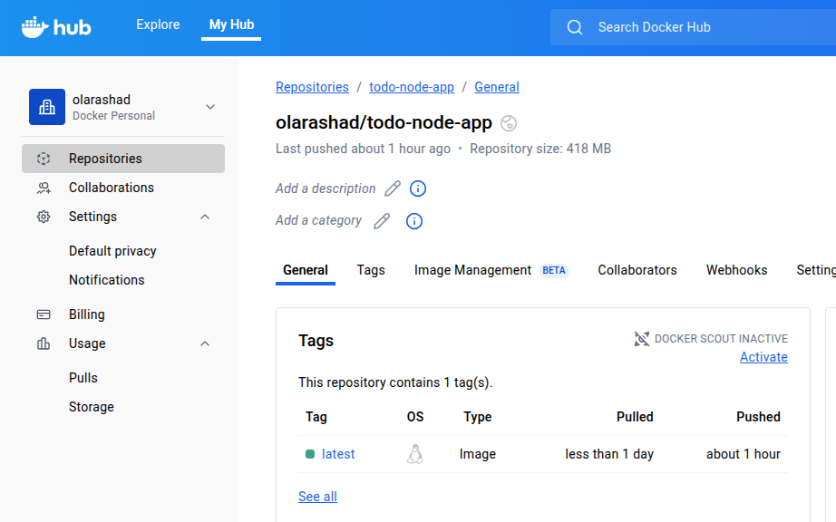
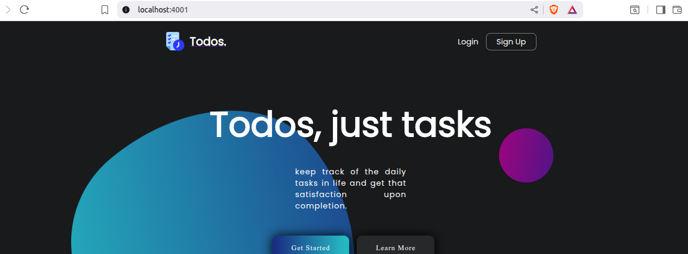
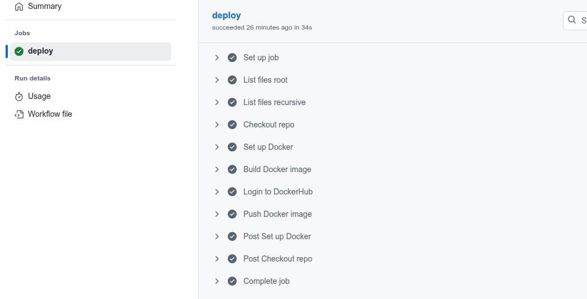
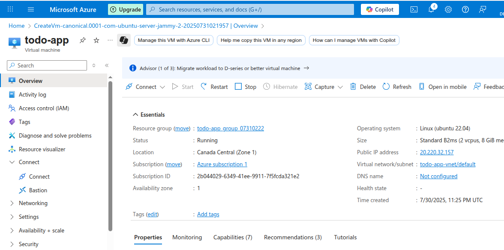
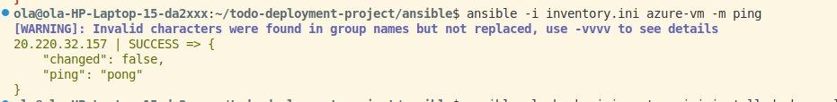
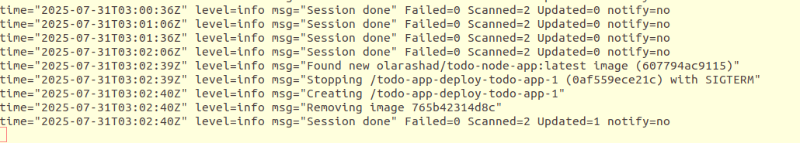

# Todo List App DevOps Project

This project demonstrates a full DevOps workflow applied on a Node.js Todo List application. It consists of 3 main parts:

1. **CI Pipeline and Dockerization**
2. **Provisioning and Configuration with Ansible**
3. **Deployment and Auto-Update using Docker Compose and Watchtower**

---
## 📁 Repo Structure

```bash
├── .github/workflows/docker-ci.yml   # GitHub Actions pipeline               
├── Todo-app-nodejs                   # Contains the todo project with it's Dockerfile 
├── todo-app-deploy/                  # Folder on the VM containing compose setup
├── ansible/                          # Ansible playbook and inventory files
├── screenshots/                      # Contains all images used in this README
└── README.md

```
## Part 1: Dockerization & CI with GitHub Actions 

### ✅ Tasks:

* Clone the repo: `https://github.com/Ankit6098/Todo-List-nodejs`
* Configure MongoDB database using `.env` file.
* Dockerize the application.
* Set up GitHub Actions to build and push the image to Docker Hub.

### 🛠 Steps:

#### 1. Clone and Configure .env:

git clone https://github.com/Ankit6098/Todo-List-nodejs.git
cd Todo-List-nodejs
```

Updated `.env` with my own database cluster on mongodb


#### 2. Dockerize:

`Dockerfile`:

```dockerfile
FROM node:18
WORKDIR /app
COPY package*.json ./
RUN npm install
COPY . .
EXPOSE 4000
CMD ["npm", "start"]
```





#### 3. GitHub Actions Workflow:

`.github/workflows/docker-ci.yml`:

```yaml
name: CI Docker Build and Push
on:
  push:
    branches: [main]
jobs:
  build:
    runs-on: ubuntu-latest
    steps:
    - uses: actions/checkout@v2
    - name: Log in to Docker Hub
      uses: docker/login-action@v1
      with:
        username: ${{ secrets.DOCKER_USERNAME }}
        password: ${{ secrets.DOCKER_PASSWORD }}
    - name: Build and push Docker image
      run: |
        docker build -t olarashad/todo-node-app:latest .
        docker push olarashad/todo-node-app:latest
```




---

## Part 2: Ansible Configuration for Remote VM 📦💻

### ✅ Tasks:

## ☁️ VM Creation using Azure

A Linux Ubuntu VM was created via the Microsoft Azure portal. Later, a directory named `todo-app-deploy` was created inside the VM to hold deployment files such as `docker-compose.yml` and `.env`. These files are included in the repository for reference and reproducibility.




* Use Ansible (from localhost) to install Docker.

### 🛠 Steps:

#### 1. Inventory:

`inventory.ini`:

```ini
[azure-vm]
20.220.32.157 ansible_user=azureuser ansible_ssh_private_key_file=~/todo-app.pem ansible_python_interpreter=/usr/bin/python3
```

#### 2. Playbook:

`install-docker.yml`:

```yaml
---
- name: Install Docker on Azure VM
  hosts: azure-vm
  become: true
  tasks:
    - name: Update apt
      apt:
        update_cache: yes

    - name: Install required packages
      apt:
        name: "{{ item }}"
        state: present
      loop:
        - apt-transport-https
        - ca-certificates
        - curl
        - software-properties-common
        - gnupg

    - name: Add Docker GPG key
      apt_key:
        url: https://download.docker.com/linux/ubuntu/gpg
        state: present

    - name: Add Docker repo
      apt_repository:
        repo: deb [arch=amd64] https://download.docker.com/linux/ubuntu focal stable
        state: present

    - name: Install Docker CE
      apt:
        name: docker-ce
        state: latest
        update_cache: yes

    - name: Add user to docker group
      user:
        name: azureuser
        groups: docker
        append: yes

```

#### 3. Run it:

```bash
ansible-playbook -i inventory.ini install-docker.yml
```



(screenshots/ansible.png)

---

## Part 3: Deployment with Docker Compose + Auto Update 🔁📦

### ✅ Tasks:

* Use Docker Compose to deploy the app.
* Add healthchecks.
* Enable auto-update using Watchtower.

### 🛠 Steps:

#### 1. `docker-compose.yml`:

```yaml

services:
  todo-app:
    image: olarashad/todo-node-app:latest
    ports:
      - "4000:4000"
    env_file:
      - .env
    restart: unless-stopped
    healthcheck:
      test: ["CMD", "curl", "-f", "http://localhost:4000"]
      interval: 30s
      timeout: 10s
      retries: 3

  watchtower:
    image: containrrr/watchtower
    volumes:
      - /var/run/docker.sock:/var/run/docker.sock
    environment:
      - WATCHTOWER_CLEANUP=true
      - WATCHTOWER_POLL_INTERVAL=30
    restart: unless-stopped
```

#### 2. Run Compose:

```bash
docker compose up -d
```

#### 3. Watchtower Logs:

To verify auto-update:

```bash
docker logs -f todo-app-deploy-watchtower-1
```




---

## 🔍 Notes:

* Used **Watchtower** for auto updates because it integrates seamlessly with Docker, monitors image changes, and restarts updated containers automatically.
* All credentials are managed securely using GitHub Secrets and `.env` files.

---

## 📌 Final Output:

* A CI/CD pipeline that builds and ships Docker images to a private registry.
* A VM provisioned with Docker using Ansible.
* A production-like Docker Compose deployment that auto-updates seamlessly.

---

## 🔚 The End!

This project mimics real-world DevOps practices, providing hands-on experience with containerization, automation, infrastructure provisioning, CI/CD, and application monitoring.

---

Feel free to reach out if you want to contribute or raise an issue!

> Made with ☕️ by Ola Rashad 💙
